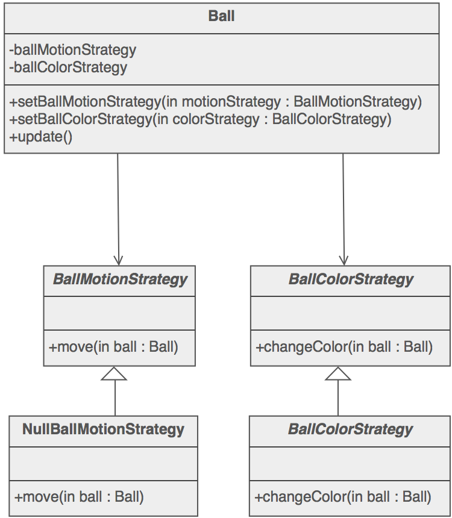

# Null Object pattern

The intent of a Null Object is to encapsulate the absence of an object by providing a substitutable alternative that offers suitable default do nothing behavior. In short, a design where "nothing will come of nothing"

Use the Null Object pattern when:

- an object requires a collaborator. The Null Object pattern does not introduce this collaboration--it makes use of a collaboration that already exists
- some collaborator instances should do nothing
- you want to abstract the handling of null away from the client

## UML

## Resources

- [Wikipedia](https://en.wikipedia.org/wiki/Null_object_pattern)
- [SourceMaking.com](https://sourcemaking.com/design_patterns/null_object)
